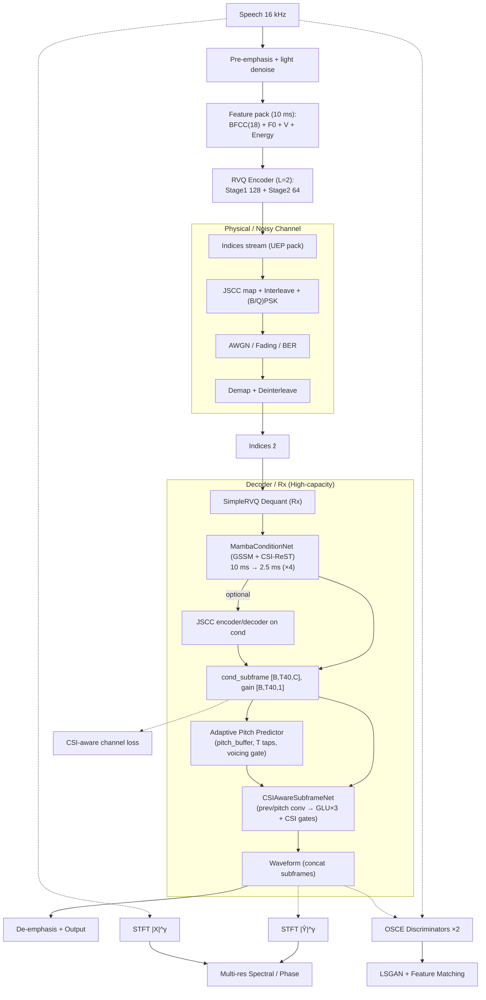
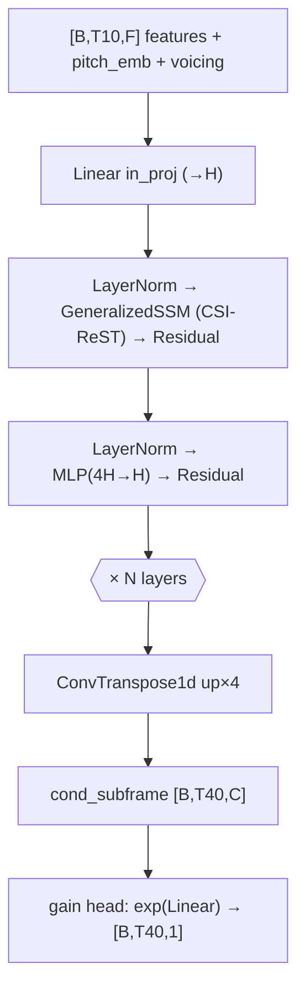
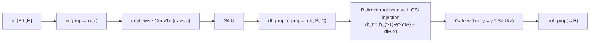
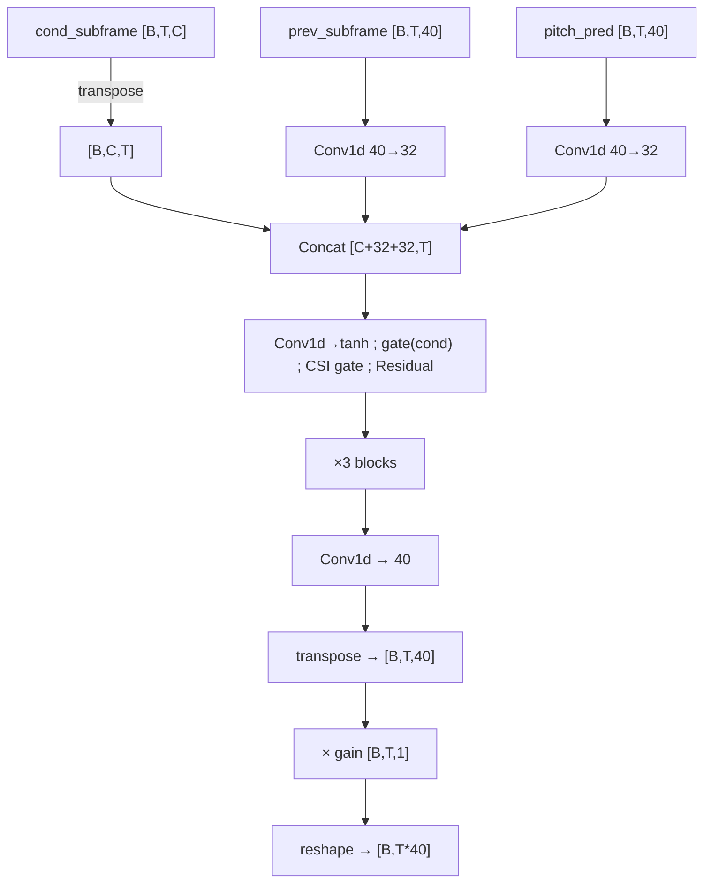
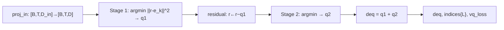
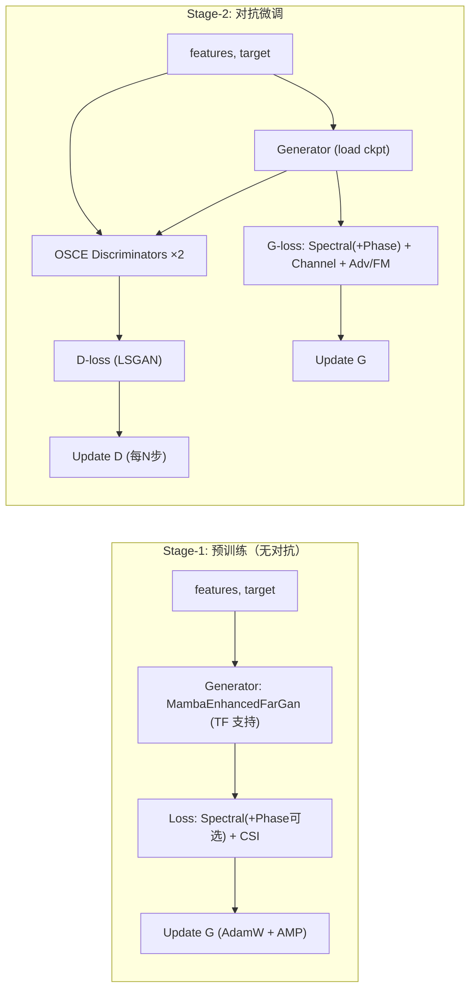
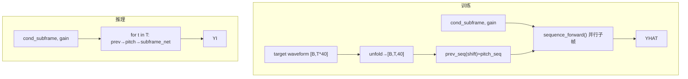

# FarGanRVQ 模型库结构综述与设计说明（基于现有代码与文档）

作者：Auto Codex 助手  
版本：2025-09-05

## 摘要
本文面向 `dnn/FarGanRVQ/models` 目录下已实现的模型族，给出统一的架构抽象、各变体的结构要点、输入输出尺寸、关键模块与损失函数设计，并结合项目文档对整体通信语音编解码方案（FarGan + RVQ + JSCC + Mamba/GSSM + CSI-ReST）的落地做法进行整理。文末附代码定位表，便于读者快速跳转至实现。

参考文档：`paper_2025-09-04-17_02_23/optimized_fargan_rvq_jscc.md`

## 1. 背景与目标
- 目标场景：窄带宽（3.2/8/16 kHz）、低 SNR（−10~10 dB）、极低码率（净 0.8–1.6 kbps）。
- 系统分工：编码端（Tx）极简、低算力、低时延（≈20 ms）；复杂度集中在接收端（Rx）。
- 架构主线：Tx 特征抽取 + RVQ 指标流 + JSCC/UEP 传输；Rx 侧进行 RVQ 解量化→条件网络（含 Mamba/GSSM 与 CSI‑ReST）→2.5 ms 子帧自回归合成→去预加重与感知对齐。

## 2. 统一解码框架（Rx）
解码端各模型基本遵循以下数据流（子帧长度 2.5 ms = 40 样本；每 10 ms 帧对应 4 个子帧）：

1) 条件建模：将帧级输入特征投影到隐藏空间，使用序列建模层（Simple/GLU/Mamba/GSSM）抽取时序上下文；随后使用 `ConvTranspose1d` 将 10 ms 时间分辨率上采样至 2.5 ms 子帧级，得到 `cond_subframe` 与自适应 `gain`。
2) 子帧合成：对每个子帧，融合上一个子帧输出 `prev_subframe` 与基音预测 `pitch_pred`，与 `cond_subframe` 拼接后经多层卷积/GLU/门控得到当前 40 样本；应用 `gain` 归一化后拼接为连续波形。
3) 可选通道自适应：部分变体引入 CSI‑ReST 门控（基于 SNR）、JSCC 编解码通道仿真，从而在训练期实现端到端通信鲁棒性优化。

形状约定：
- 输入特征 `features`: `[B, T10, F]`（10 ms 帧率）；上采样后 `T40 = 4 * T10`。
- 条件特征 `cond_subframe`: `[B, T40, C]`；`gain`: `[B, T40, 1]`。
- 子帧输入 `prev_subframe/pitch_pred`: `[B, T40, 40]`；输出波形 `[B, T40*40]`。

## 3. 模型族总览

3.1 轻量基线与优化版
- FeatureToWaveMLP（极简基线）
  - 文件：`dnn/FarGanRVQ/models/baseline.py:1`
  - 结构：将 `[B,T,F]` 直接展平后经两层 MLP 产生一段波形（无时序/AR/基音建模）。
  - 用途：用于快速端到端打通、最小可行对比基线。

- OptimizedFarGan（优化版 FarGan）
  - 文件：`dnn/FarGanRVQ/models/optimized_fargan.py:1`
  - 条件网络：`Linear → Conv1d → ConvTranspose1d(up×4)`，输出 `cond(96)` 与 `gain`。
  - 子帧网络：`prev(40)→Conv1d(32)`、`pitch(40)→Conv1d(32)` 与 `cond` 拼接，经 3×GLU（通道 160）与 `Conv1d → 40`；输出按子帧拼接为波形。
  - 特点：结构紧凑、实现清晰，便于在 Rx 端快速部署与调参。

3.2 放大版（更高容量）
- LargerFarGan（更大模型）
  - 文件：`dnn/FarGanRVQ/models/larger_fargan.py:1`
  - 条件网络：更深的 `Linear×2 + Conv1d×2 + TConv`，`cond_dim=192`，带 dropout。
  - 子帧网络：更深的 GLU 栈（5 个块，最高 512 通道），输出头 `Conv1d(256→40)`。
  - 特点：在高算力 Rx 侧提升表达能力、增加上下文建模深度。

3.3 增强版（引入 Mamba/SSM 与更强的条件/子帧建模）
- EnhancedFarGan（改进版 FarGan）
  - 文件：`dnn/FarGanRVQ/models/enhanced_fargan.py:1`
  - 亮点：
    - `MambaBlock` 简化实现用于高效序列建模；
    - `EnhancedConditionNet`：Mamba×2 + `ConvTranspose1d` 上采样 + 自适应 `gain/bias`；
    - `AdaptivePitchPredictor`：多抽头插值 + voicing 感知门控；
    - `EnhancedSubframeNet`：`prev/pitch` 经 `Conv1d` 提取 64 维特征后与条件拼接，Mamba×3，残差门控与自适应归一化。
  - I/O：支持 period/voicing 嵌入；维护 `pitch_buffer`。

- MambaEnhancedFarGan（MambaJSCC 增强版）
  - 文件：`dnn/FarGanRVQ/models/mamba_enhanced_fargan.py:1`
  - 亮点：
    - `GeneralizedSSM`（GSSM）与 CSI‑ReST 融合至条件网络；
    - `CSIAwareSubframeNet`：在子帧 GLU 主干上加入 CSI 门控；
    - 可选 JSCC 通道（`jscc_encoder/decoder`）与 `channel_noise` 仿真；
    - 配套损失 `MambaJSCCEnhancedLoss`：多分辨率 STFT、对抗与 CSI 自适应项。

- MambaFarGanJSCC（另一套 Mamba+JSCC 方案）
  - 文件：`dnn/FarGanRVQ/models/mamba_fargan_jscc.py:1`
  - 亮点：
    - `CSIAwareMambaBlock` 堆叠处理 10 ms 条件，`ConvTranspose1d` 上采样至子帧；
    - 内置 `JSCCEncoder/Decoder`（卷积压缩/展开 + 误差保护 + CSI 自适应）；
    - 子帧合成网络为文件内 `EnhancedSubframeNet` 变体（含门控/残差/CSI 调制）。

3.4 量化与损失模块
- SimpleRVQ（残差矢量量化，Rx 侧使用）
  - 文件：`dnn/FarGanRVQ/models/rvq.py:1`
  - 结构：输入经投影到代码维 `d_code`，逐级残差量化，输出去量化特征 `deq`、各级索引与 VQ 损失；与文档中 Tx/Rx 的 RVQ 互补。

- 增强损失集合
  - 文件：`dnn/FarGanRVQ/models/enhanced_losses.py:1`
  - 组成：`PhaseAwareSpectralLoss`（相位一致）、`PitchConsistencyLoss`（周期性）、`PerceptualLoss`（Mel 感知动态）、`AdversarialFeatureMatchingLoss` 与 `EnhancedCompositeLoss`（含可学习权重）。

3.5 占位与接口
- `encoder.py: RVQEncoder`、`decoder_fargan.py: FarGanDecoder`、`jscc.py: JSCC` 当前为占位类，便于与完整系统（Tx 端或外部 JSCC/UEP）衔接。

## 4. 关键模块详解

4.1 条件网络（Condition Net）
- 目标：在 Rx 侧将帧级特征提升为子帧级条件；容纳通道/CSI/RVQ 解量化信息。
- 变体：
  - Simple/Optimized：`Linear/Conv1d + TConv(up×4)`，高效紧凑；
  - Larger：堆叠更深的全连接与卷积层，`cond_dim` 提升至 192；
  - Enhanced/Mamba*：引入 Mamba/GSSM，并行化的状态空间序列建模，结合 CSI‑ReST 实现随信道自适应的动态调制；支持 `gain` 与可选 `bias`。

4.2 子帧合成网络（Subframe Net）
- 输入：`prev_subframe(40)` 与 `pitch_pred(40)` 经 `Conv1d` 提取特征，与 `cond_subframe(C)` 拼接；
- 主干：多层 `Conv1d(k=3)` + GLU/tanh 门控/残差；部分变体含 Mamba 块或 CSI 门控；
- 输出：`Conv1d(k=1) → 40`，再乘以 `gain` 并拼接为波形；
- 稳定性：残差门控、增益归一化与（在增强版中）自适应 `bias` 提升训练稳定性与动态范围适配。

4.3 基音预测与缓冲
- `AdaptivePitchPredictor`（增强/融合版本）：多抽头插值（learned taps）+ voicing 感知门控 + 轻量一维卷积细化；
- 简化实现：以历史子帧构造 `pitch_pred`，在周期 <40 时采用回退策略；
- 缓冲：维护 `pitch_buffer` 以跨子帧/帧提供周期性上下文。

4.4 JSCC 与 CSI‑RESt 融合
- JSCC：部分模型内置 `JSCCEncoder/Decoder`（卷积压缩/保护/展开），可在训练中注入 `channel_noise`；
- CSI‑RESt：在条件与子帧网络中以线性/卷积门控注入 `csi`（SNR），低 SNR 强化稳健性损失权重与门控抑制；
- 与文档一致：和“技术说明”中 mermaid 流程相对应（`RVQ→GSSM×N→TConv→Subframe(GLU/CSI)`）。

4.5 损失与训练
- 多分辨率 STFT（可选相位感知）、对抗 + 特征匹配、Mel 感知动态、Pitch 一致性、CSI 自适应；
- 组合损失：`EnhancedCompositeLoss` 提供可学习权重自调；`MambaJSCC*Loss` 提供 JSCC/CSI 感知的端到端损失；
- 优化器与策略：支持混合精度、梯度裁剪、余弦调度等（细节见训练脚本与文档）。

## 5. I/O 与尺寸对齐
- 每 10 ms 帧生成 4 个子帧；子帧输出 40 样本 → 每帧 160 样本；
- `target_length`：部分实现支持按样本数对输出裁剪或补零对齐；
- Pitch/Voicing 嵌入：增强版/融合版在条件侧显式引入周期与清浊音；
- RVQ：`SimpleRVQ` 在 Rx 侧产生连续 `cond`（与 Tx 侧 RVQ 指标流对接）。

## 6. 复杂度与部署建议（Rx）
- 优先在在线场景使用 `OptimizedFarGan` 或 `EnhancedFarGan`：二者在表达与效率间取平衡；
- 高算力/离线或研究：`LargerFarGan`、`Mamba*` 变体可获得更强感知质量与鲁棒性；
- 当存在真实信道或强噪环境：优先使用带 CSI/JSCC 的 Mamba 融合版本；
- 若端到端（含 Tx）未就绪，可以 `SimpleRVQ` 的解量化输出或直接以 10 ms 经典特征作为输入进行预训练。

## 7. 与项目文档的一致性
- 文档的“整体结构/训练与损失/关键超参数/落地步骤”与上述实现逐项对应：
  - RVQ(L=2)、UEP/交织、B/QPSK 与通道噪声仿真在代码中以占位或可选路径体现；
  - 条件网络采用 Mamba/GSSM 与 CSI‑RESt 的版本即文档“已实现”路径；
  - 子帧 AR 合成（prev+pitch）与增益归一化、相位感知谱损失、OSCE 判别器接口均已在模型/损失中对接；
  - 低频谐波先验分支在代码中为“待实现”位（可作为后续扩展）。

## 8. 待完善事项（优先级建议）
1) Tx 侧 RVQ 与特征流水线的轻量实现与量化部署（与占位 `encoder.RVQEncoder` 对齐）。
2) JSCC UEP 与交织/解交织在推理管线中的标准化接口（替换占位 `jscc.JSCC`）。
3) 低频先验谐波分支与判别器门控融合；
4) PitchConsistencyLoss 在实际训练中的门控启用（voicing + 有效周期）；
5) 端到端码率约束与 RVQ 码书/温度退火训练策略联动；
6) 模型蒸馏与 INT8/FP16 混合量化以适配边缘硬件。

## 9. 代码定位（按文件）
- `dnn/FarGanRVQ/models/baseline.py:1`：`FeatureToWaveMLP`
- `dnn/FarGanRVQ/models/optimized_fargan.py:1`：`ConditionNet`、`SubframeNet`、`OptimizedFarGan`
- `dnn/FarGanRVQ/models/larger_fargan.py:1`：`LargeConditionNet`、`LargeSubframeNet`、`LargerFarGan`
- `dnn/FarGanRVQ/models/enhanced_fargan.py:1`：`MambaBlock`、`EnhancedConditionNet`、`AdaptivePitchPredictor`、`EnhancedSubframeNet`、`EnhancedFarGan`
- `dnn/FarGanRVQ/models/mamba_enhanced_fargan.py:1`：`GeneralizedSSM`、`MambaConditionNet`、`CSIAwareSubframeNet`、`MambaEnhancedFarGan`、`MambaJSCCEnhancedLoss`
- `dnn/FarGanRVQ/models/mamba_fargan_jscc.py:1`：`GeneralizedSSM`、`CSIAwareMambaBlock`、`MambaFarGanJSCC`、`JSCCEncoder/Decoder`、文件内 `EnhancedSubframeNet` 变体、`MambaJSCCLoss`
- `dnn/FarGanRVQ/models/rvq.py:1`：`SimpleRVQ`
- `dnn/FarGanRVQ/models/enhanced_losses.py:1`：谱/相位/感知/对抗/复合损失
- `dnn/FarGanRVQ/models/encoder.py:1`、`decoder_fargan.py:1`、`jscc.py:1`：占位/接口

## 致谢
本文档基于仓库当前实现与“优化版 FarGan 编解码 + JSCC 技术说明”的内容整理而成，旨在为后续论文撰写、实验复现与工程落地提供统一参考。

## 10. 结构流程图（系统与模块）

10.1 整体系统（Tx→Channel→Rx）

说明：图中 cond 上的 JSCC 分支为可选（训练中用于通道鲁棒性增强）。

10.2 MambaConditionNet（条件网络，10 ms→2.5 ms）

10.3 GeneralizedSSM（GSSM，简化数据流）

10.4 CSIAwareSubframeNet（子帧合成，2.5 ms）

10.5 SimpleRVQ（残差矢量量化，Rx 侧解量化）

10.6 训练策略（两阶段）

10.7 训练期并行子帧（Teacher Forcing）与推理 AR 对照

